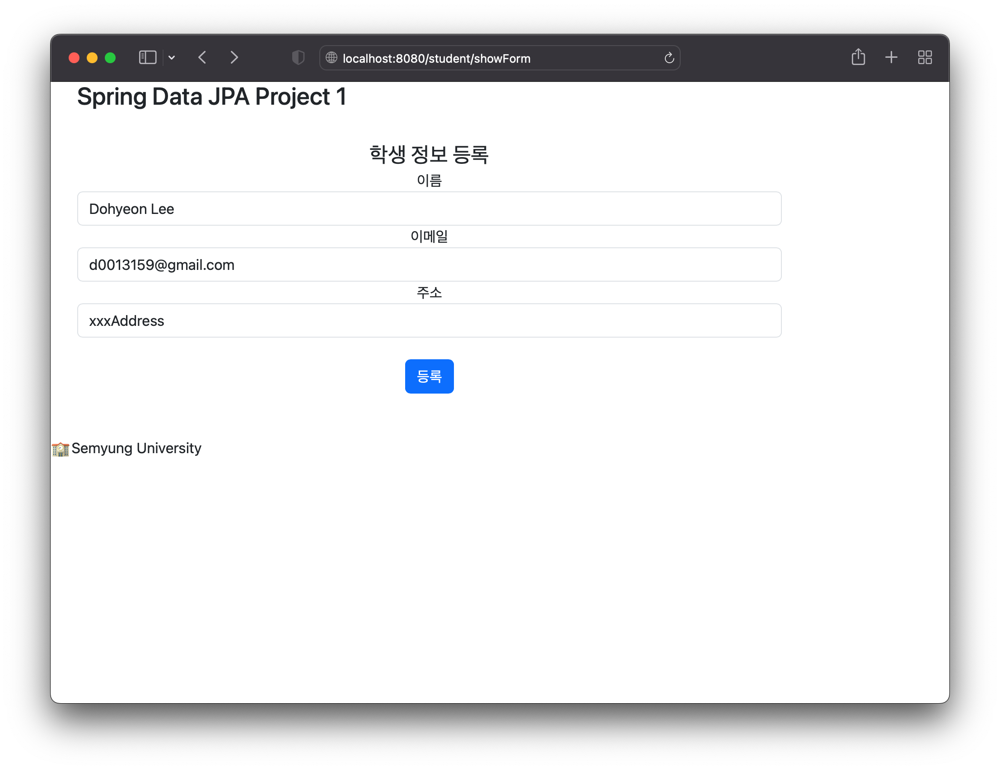
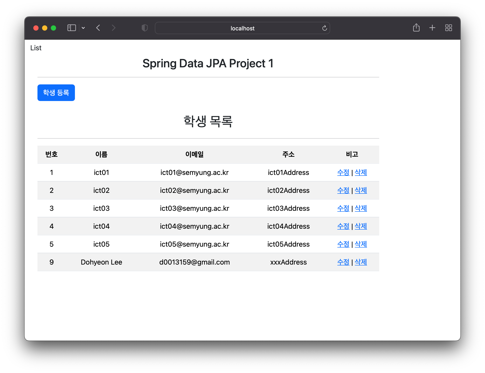

# JpaProject01

이 프로젝트는 MySQL, MySQL Workbench, 그리고 Spring을 사용하여 학생 정보를 등록하고 관리하는 웹 애플리케이션입니다. 사용자는 웹 인터페이스를 통해 학생 정보를 추가, 수정, 삭제할 수 있으며, 등록된 모든 학생 정보를 리스트 형태로 조회할 수 있습니다.

## 주요 기능

- **학생 정보 등록**: 새로운 학생의 정보를 데이터베이스에 등록합니다.
- **학생 정보 조회**: 등록된 모든 학생의 정보를 리스트 형태로 보여줍니다.
- **학생 정보 수정**: 특정 학생의 정보를 수정합니다.
- **학생 정보 삭제**: 특정 학생의 정보를 데이터베이스에서 삭제합니다.

## Main Page

## List Page

